使用手册
=======

##登录
打开浏览器，输入您的域名 + /index.php/admin/default/login，回车后可看到后台登录界面。
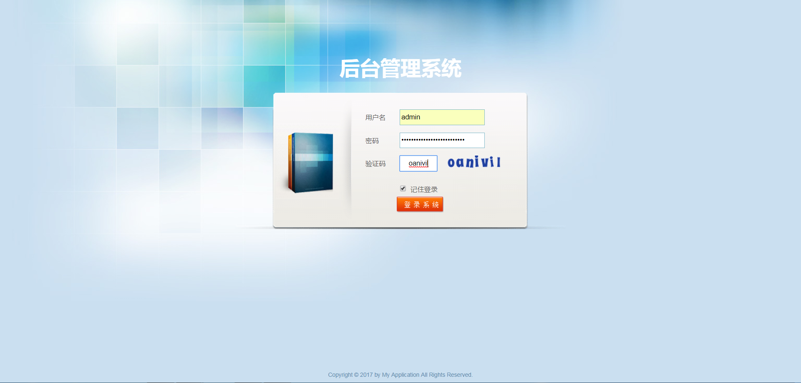
输入用户名和密码以及正确的验证码，点击登录进入后台主页面。

##功能简介
后台从功能上划分为两大块，全局管理和店铺管理，其中全局管理包括：

- 系统管理
　
	- 分站管理
	- 用户管理
- 站点管理
	- 常规设定
	- 分类管理
	- 推送位管理
	- 自定义表单管理
- 内容管理
	- 单文章管理
	- 资讯管理
	- 留言管理 

店铺管理包括：

- 品牌管理
- 商品类型管理
- 商品规格管理
- 商品管理
	- 商品管理
	- 单品管理 
- 会员管理
- 订单管理
- 单品评论管理

下面我们一一阐述各功能模块的作用和使用说明。

## 系统管理（站点管理）
站点指的是针对同一后台，我们可以开设多个站点，而多个站点的数据我们可以在同一个后台进行管理，这样的话，我们不需要负责多个后台的开发，只需要专注于前端的数据调取和效果的实现即可，提升了项目的开发进度。

点击“系统管理”中的“站点管理”后，打开的界面如下所示：
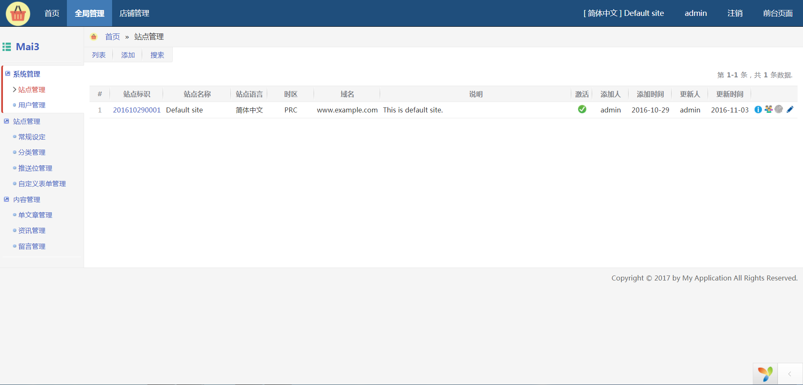
在站点管理中，我们可以设置该站点使用的时区、域名、所采用的语言等设置。

## 系统管理（用户管理）
用户指的是系统的后台管理用户，同一个用户可以管理一个或者多个站点。列表页面如下所示：
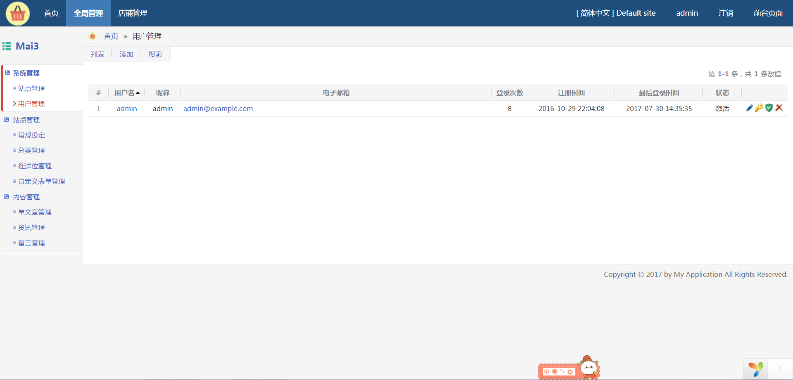

用户管理的操作也是十分简单，需要注意的是在整个系统中，用户的用户名必须保持唯一。

从用户管理列表页面中，我们可以看到，除了添加用户之外，我们还可以针对用户进行密码修改，可管理节点权限设置、删除等操作。

###修改用户密码
在用户管理列表中，每一行数据的右侧，我们可以看到几个操作按钮。钥匙形状的就是修改用户密码的操作按钮了，点击之后，我们可以重新为忘记密码的用户修改密码。

###设置用户可管理节点
在用户管理列表中，每一行数据的右侧，我们可以看到几个操作按钮。盾牌形状的就是设置用户可管理节点的操作按钮了，点击之后，如下图所示：
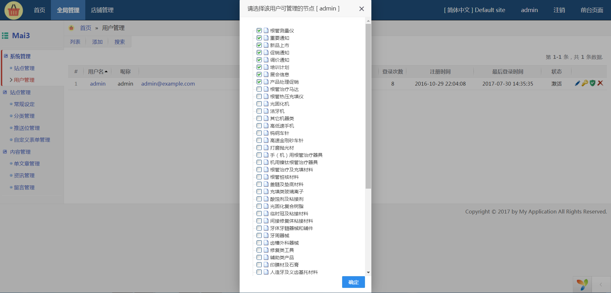

勾选您要为用户设置的节点之后，点击确定即可。

##站点管理（常规设定）
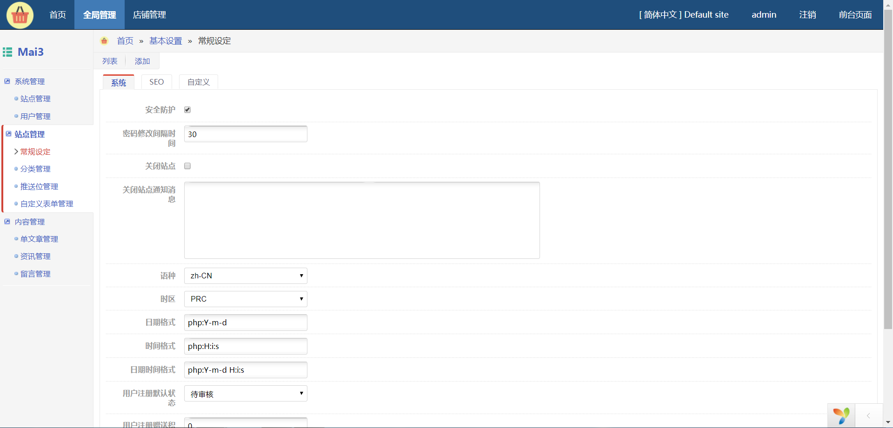

在常规设定中，我们可以设置是否启用安全防护，用户密码修改间隔时间等之类参数。设置完毕后，点击“提交”按钮，系统会根据您所设定的参数进行处理。

##站点管理（分类管理）
众所周知，分类是一个商城系统最基本的构成之一，分类从目前主流的系统和架构来说，不宜超过三层，层数过多，造成用户需要点击多次后才能具体定位到自己所需要的商品，用户体验度不好。所以在设置的时候需要记住该原则，当然，如果由于业务的需要，您完全可以做成超过三级设置无限极。

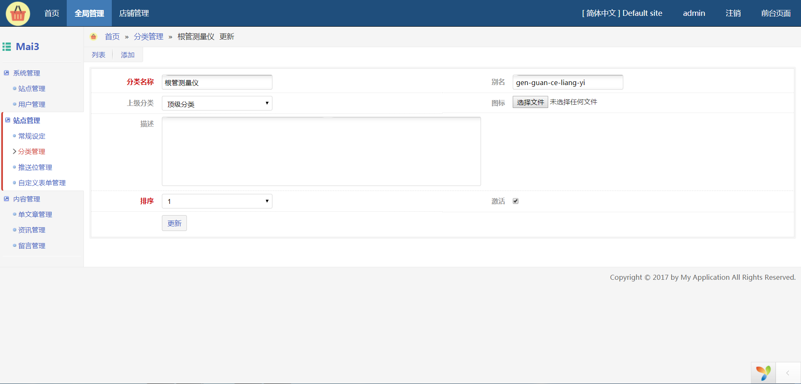

分类管理表单如上所示，需要注意的是，别名在分类中必须唯一，且使用英文字母作为别名。

##站点管理（推送位）
需要了解什么是推送位，我们来呈现一个常见的业务场景。经常，我们需要展示特价商品、促销商品等数据，而针对此种业务需求，有固定的，也有根据不同的业务需求而定制的，比如 6.6 作为公司的周年庆，我们推出一部分商品作为特价回馈给消费者等。

基于此种需求，系统设置了推送位这一功能。简单点说，我们可以在后台设置一个或者多个推送位，设置完毕之后，添加商品的时候我们就可以给商品打标，比如“特价商品”，那么前台数据在调取的时候，就可以传递特定的推送位获取到相应的数据。从而达到定向显示的需求。推送位的数据操作表单如下：
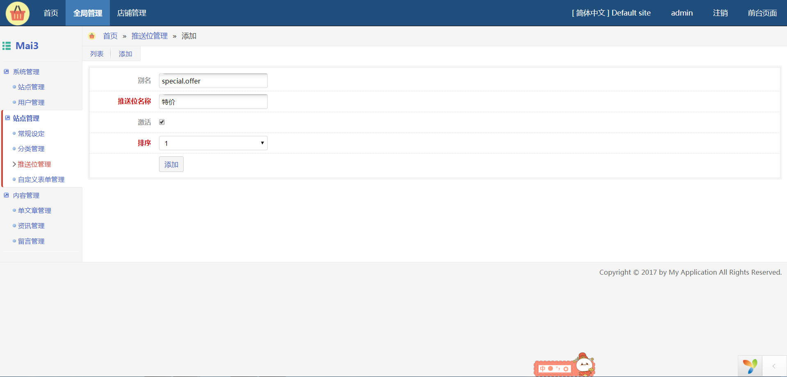

需要注意的是别名需要使用小写的英文字母 + “.” 组成。

##内容管理（单文章管理）
单文章管理指的是针对如“关于我们”、“联系我们”之类文章的管理。

##内容管理（资讯管理）
资讯管理指的是针对资讯文章的管理。

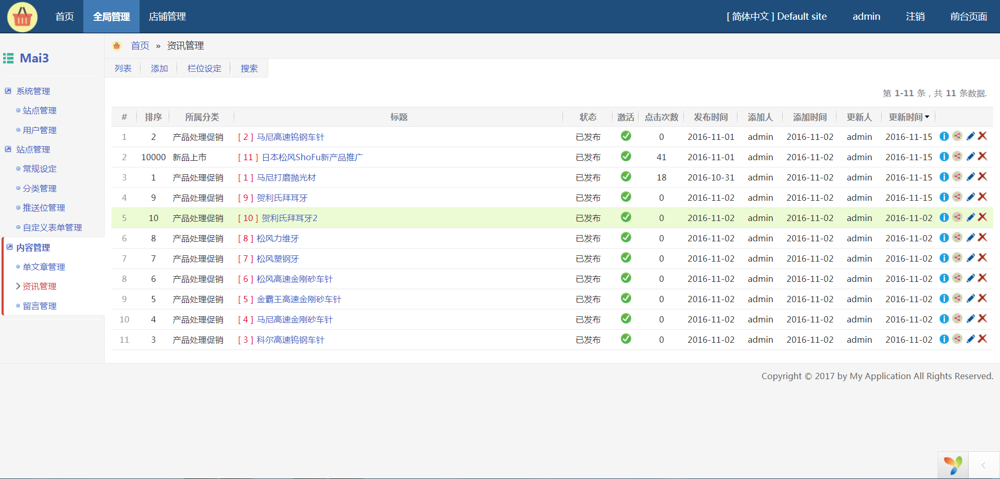

我们可以针对资讯进行添加、更新、删除等操作，另外，您也可以设置推送位进行数据的推送管理。

##内容管理（留言管理）
留言管理主要是针对和浏览者互动说产生的消息的管理。浏览者在前台通过表单提交相关信息后，后台即可以看到，方便及时和浏览者互动或联系。

##店铺管理（品牌管理）

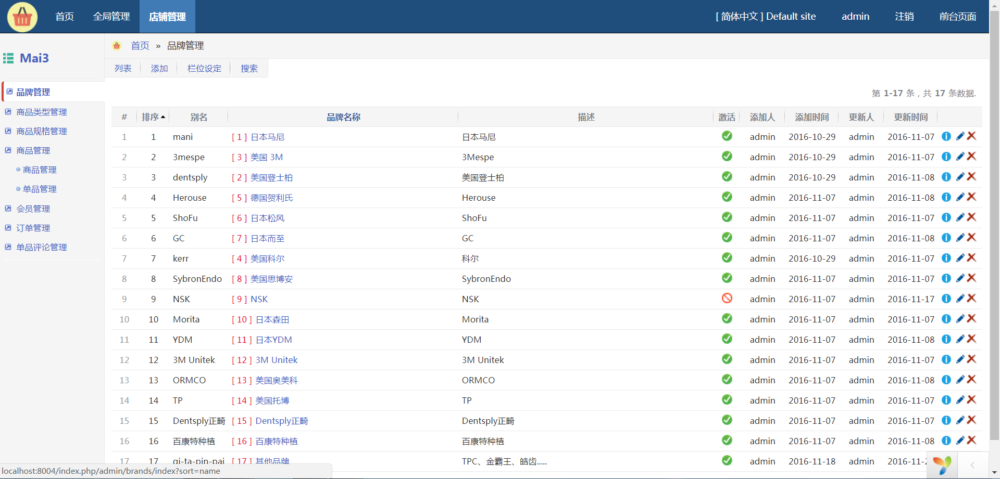

在品牌管理中，我们可以管理商城销售商品的品牌，对品牌的名称、图标、别名等进行管理

##商铺管理（商品类型管理）
在商品中，我们可以根据商品的性质划分商品的类型，比如手机、护肤品等，每个类型的商品可以关联相应的品牌和扩展属性，并可以关联相应的规格。

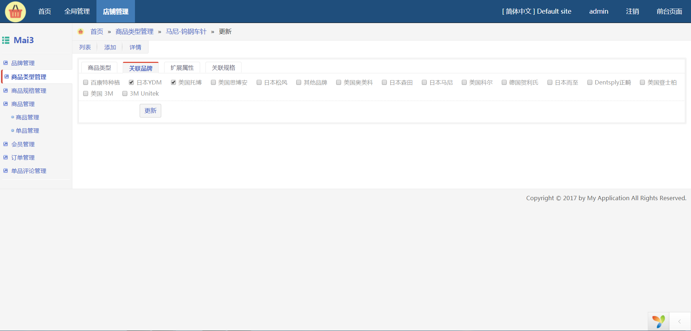

##商品管理（商品规格管理）
商品规格指的是根据商品的某一个属性进行商品的细分。以手机为例，根据颜色来区分的话，手机有白色、黑色、金色等规格。根据存储空间大小来区分的话，有 16G、32G、64G 等规格。这样的区分，能够最小化，方便使用之后能够快速的定位到所需的商品。

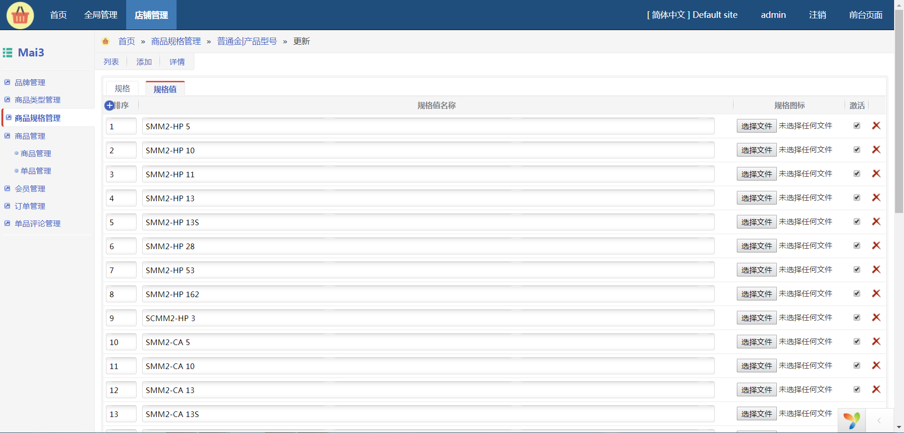

##商品管理
商品管理划分为两类，一类指的是商品本身的管理，一类指的是单品的管理。商品本身的管理比较容易理解，比如手机就是一个单独的商品。那么什么是单品呢？单品指的是根据商品的规格和属性划分出来的单个商品类型，业内来说，就是指 SKU。

> SKU=Stock Keeping Unit（库存量单位）。即库存进出计量的基本单元，可以是以件，盒，托盘等为单位。SKU这是对于大型连锁超市DC（配送中心）物流管理的一个必要的方法。现在已经被引申为产品统一编号的简称，每种产品均对应有唯一的SKU号。单品：对一种商品而言，当其品牌、型号、配置、等级、花色、包装容量、单位、生产日期、保质期、用途、价格、产地等属性与其他商品存在不同时，可称为一个单品。

单品是最小的商品单位，设置了单品之后，我们就可以针对单品做销售统计之类的操作。举例来说，比如某个商品商城共销售了 1000 台，但是从数据本身来看，我们并不知道该商品具体型号的销售情况，但是，如果我们销售的商品是单品的话，我们则可以看到该商品 A 型号销售了 300 台，B 型号销售了 700 台。这样的销售数据有利于我们对商品的业务进行具体的分析，为销售抉择提供验证数据。

##店铺管理（会员管理）
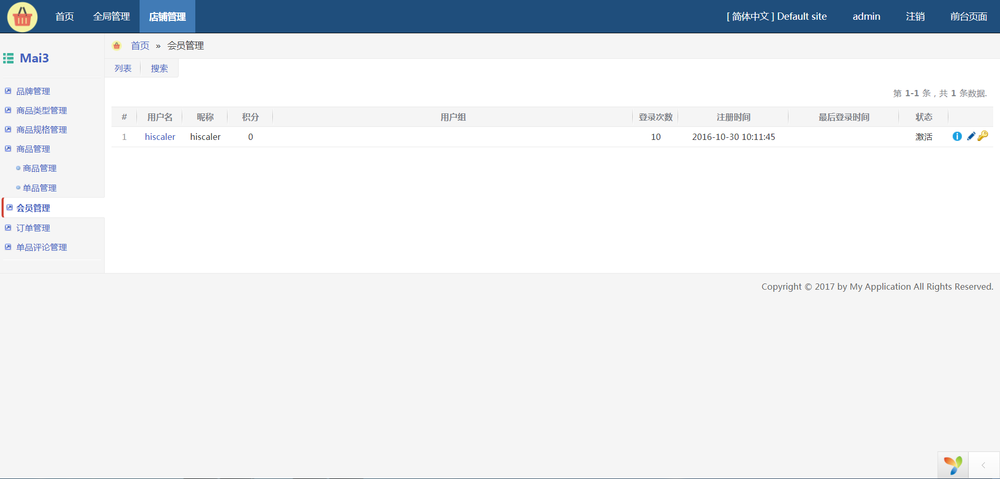

会员管理针对的是商城注册的会员的统一管理。当然，我们也可以在会员忘记密码的情况下对会员的密码进行重置。

##店铺管理（订单管理）
作为一个商城系统基本也是比较重要的环节之一，订单是我们针对会员下单后对下单数据查看和处理的步骤。在订单管理页面中，我们可以看到会员所下的订单，以及订单中包含的具体单品数据。管理员可以针对订单和会员联系，并处理收发货。

##店铺管理（单品评论管理）
现有的商城系统基本都提供了单品的评论功能，当然，我们的系统也不例外，在前端，会员可以针对某一个商品进行评论，评论的内容后台用户可以看到，后台用户确认之后，其他会员就可以看到评论信息。

